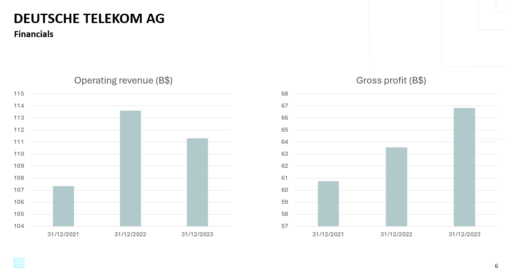

# PyConsulting

Leverage the power of AI and Python to do beautiful & data centric presentations like the following:


## Example
We have automated the process of creating basic financials analysis presentation, combining publicly available data on Yahoo finance, and the LLM's knowledge. You can run it with the following:

```
pip install -r requirements.txt
python src/main.py
```
Please note you will have to link your AWS account, creating the [.env](/src/.env) file like explained in [.env.example](./src/.env.example)
The generated presentation should end up in the [out dir](./out/).